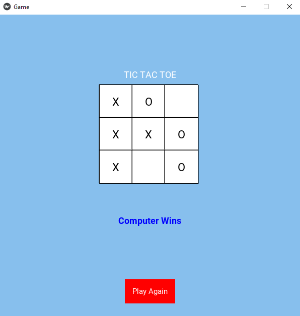

## Kivy Tic Tac Toe

Its a Tic Tac Toe game made with Kivy. The computer moves works with the help of `Minimax` algorithm.



### Kivy Installation

1. Create Virtual Environment

For windows:

```
python -m venv venv
```

For Linux:

```
python3 -m venv venv 
```

Here `venv` is the name of virtual environment.

2. Install Kivy

```
python -m pip install kivy[base] kivy_examples
```

### Run Project

1. Git Clone

```
git clone https://github.com/stackquest/ai_tic_tac_toe.git
```

2. Activate virtual environment

For windows:

```
.\venv\Scripts\activate
```

For Linux based systems:

```
source venv/bin/activate
```
3. Navigate to directory

```
cd ai_tic_tac_toe
```
4. Run project

```
python main.py # for Windows
python3 main.py for Linux
```

### Credits

**Since repository contains other scripts, I didn't forked the repo. However giving credits below for original author:**

[soumys567](https://github.com/soumyas567/Python_Projects/blob/main/Tic%20Tac%20Toe/tictactoeai.py)

[](https://www.youtube.com/watch?v=I6zp8B4J6iw)

### Known Issues

1. [ ] ~~Little bit slower for first move. That is why **Play Again** is also little bit slower at first move. It needs to fix.~~
2. [x] Not responsive. For low resolution screens board may clip.
3. [x] Code quality can be improved
